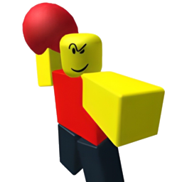
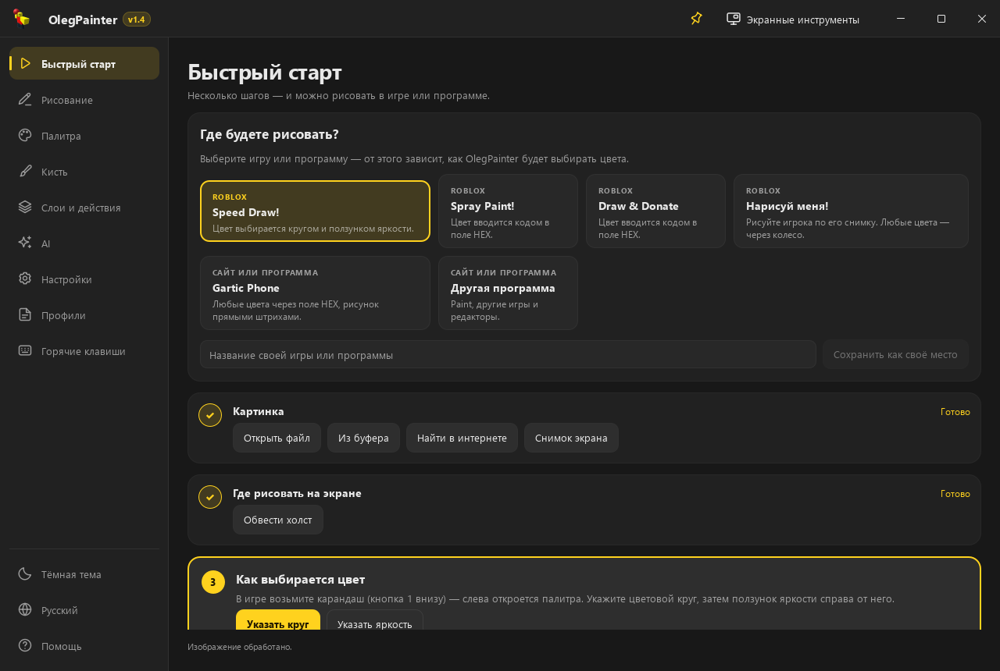
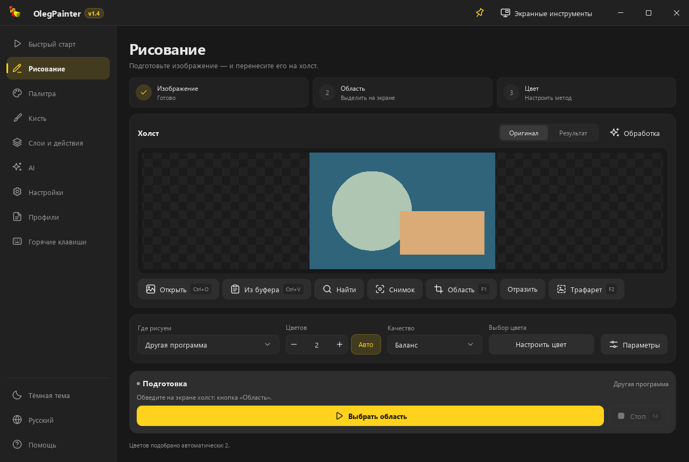
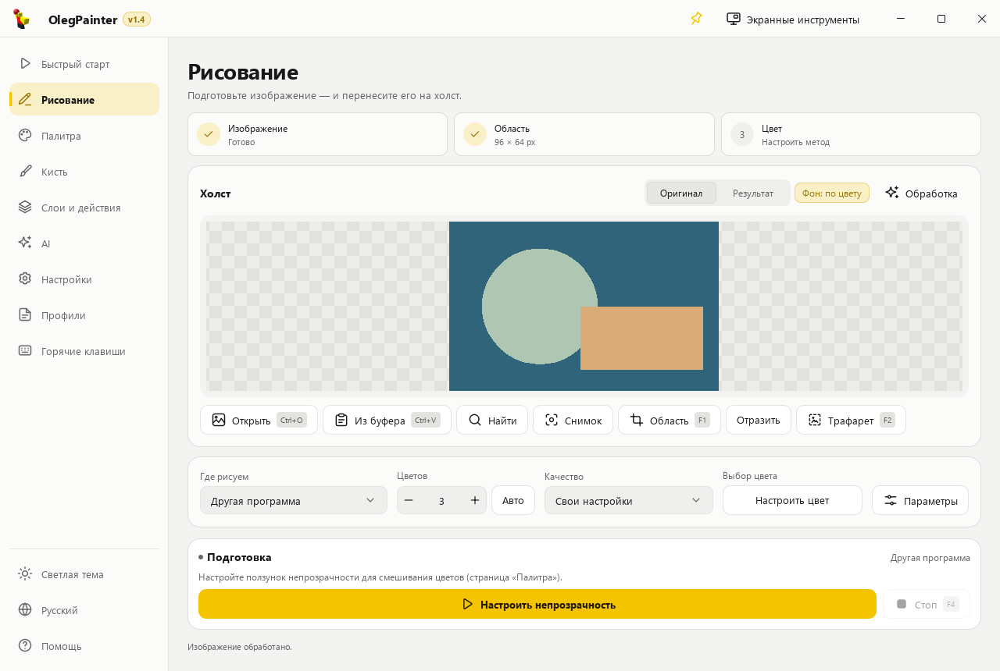
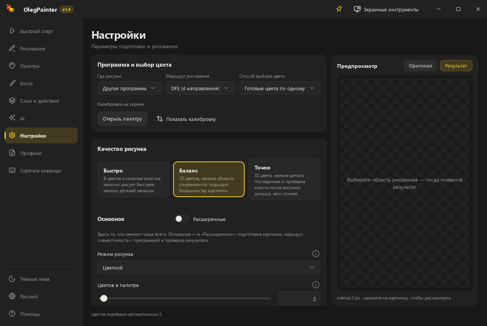
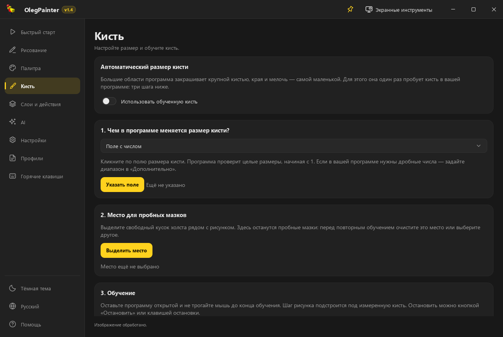

<p align="center">
  
</p>

<h1 align="center">OlegPainter</h1>

<p align="center">
  <b>Рисует любую картинку мышью — в Paint, браузерных играх и Roblox.</b><br>
  Бесплатно и с открытым исходным кодом.
</p>

<p align="center">
  
  
  
  
</p>

<p align="center">
  <a href="docs/INSTALL.md">Установка</a> ·
  <a href="docs/GUIDE.md">Руководство</a> ·
  <a href="docs/FAQ.md">Вопросы и проблемы</a> ·
  <a href="CHANGELOG.md">Что нового</a> ·
  <a href="#english">English</a>
</p>

<p align="center">
  
</p>

## Что это

Вы выбираете картинку, показываете программе холст и палитру, нажимаете **F3** — и OlegPainter рисует её настоящей мышью: штрих за штрихом, цвет за цветом, как художник. Программа сама подготовит изображение: уберёт фон, подберёт цвета под палитру игры или программы и проложит быстрый маршрут кисти.

## Возможности

| | |
| --- | --- |
| 🚀 **Быстрый старт** | Несколько шагов от картинки до готового рисунка — с подсказками и короткими видео для каждой игры. |
| 🎮 **Готовые места** | Speed Draw!, Spray Paint!, Draw & Donate, «Нарисуй меня!», Gartic Phone, табличка в Rust — и «Другая программа» для Paint и любых редакторов. Свои игры можно сохранить в «Мои места». |
| 🖼️ **Картинка откуда угодно** | Файл, буфер обмена, перетаскивание из браузера, ссылка, снимок экрана или поиск в Яндексе, Google, Bing, DuckDuckGo, Pinterest и Openverse. |
| ✂️ **Обработка в одном окне** | Удаление фона (автоматически, нейросетью, по цвету или кистью), цвет и свет, фильтры, отражение, отмена шагов. |
| 🎨 **Умные цвета** | Подбор палитры в перцептивных пространствах CIELAB и OKLab и точное сравнение CIEDE2000; пресеты качества «Быстро», «Баланс», «Точно». |
| 🖌️ **Любой способ выбора цвета** | Образцы палитры, поле HEX, цветовое колесо, «палитра рамкой» и смешивание полупрозрачных слоёв. |
| 🧠 **Самообучение под программу** | Подбирает скорость мыши и изучает регулятор размера кисти пробными мазками — крупные области закрашиваются большой кистью, детали — маленькой. |
| 🗺️ **Быстрые маршруты** | DFS-заливка, «Прямые отрезки», «Контур + заливка», «Только контур»; мелкие детали можно рисовать последними. |
| 🪟 **Трафарет и HUD** | Полупрозрачная калька поверх холста (F2) и панель прогресса с оставшимся временем. |
| 🤖 **Локальный ИИ — по желанию** | Удаление фона, выбор объекта кликом, порядок по глубине, контуры из фото, увеличение. Модели работают на вашем компьютере и ставятся только по вашему выбору. |
| 🌗 **Удобство** | Тёмная и светлая темы, русский и английский языки, профили настроек, горячие клавиши. |

## Где рисует

| Место | Как выбирается цвет | Особенности |
| --- | --- | --- |
| **Speed Draw!** (Roblox) | цветовой круг и ползунок яркости | раунды на время |
| **Spray Paint!** (Roblox) | поле HEX | штампы баллончика |
| **Draw & Donate** (Roblox) | поле HEX | — |
| **«Нарисуй меня!»** (Roblox) | кольцо и квадрат | снимок игрока без фона |
| **Gartic Phone** (браузер) | 18 образцов или поле HEX | прямые штрихи под особенности игры |
| **Rust** (Steam) | поле HEX | табличка; темп штрихов подобран так, чтобы игра не зависала |
| **Другая программа** | образцы палитры или «палитра рамкой» | Paint, Paint.NET, Krita, веб-редакторы и др. |

## Как нарисовать первую картинку

1. **Запустите OlegPainter** и откройте «Быстрый старт».
2. **Выберите место** — игру или программу, где будете рисовать.
3. **Дайте картинку** — файлом, из буфера, поиском или снимком экрана.
4. **Обведите холст** (F1) и покажите цвета — программа подскажет, что именно нажать.
5. **Нажмите F3.** Остановить — F4.

Подробно — в [руководстве](docs/GUIDE.md).

## Скриншоты

<table>
  <tr>
    <td></td>
    <td></td>
  </tr>
  <tr>
    <td></td>
    <td></td>
  </tr>
</table>

## Установка

Скачайте архив со страницы **Releases**, распакуйте в обычную папку (не в «Program Files») и запустите `OlegPainter.exe`. Для запуска из исходников нужен Python 3.13. Пошагово — в [инструкции по установке](docs/INSTALL.md).

> [!WARNING]
> **Драйвер мыши Interception — сторонний.** Чтобы рисовать в играх, OlegPainter использует драйвер ввода [Interception](https://github.com/oblitum/Interception) (автор — Francisco Lopes). Он не входит в OlegPainter: мы его не разрабатываем и **не несём ответственности за его работу и ошибки**. Ставить его или нет — решаете вы: программа скачивает официальный установщик автора, проверяет его контрольную сумму и запускает только после того, как вы прочитаете предупреждения и отметите все пункты. **Игры с античитами** (Easy Anti-Cheat, Riot Vanguard, EA Javelin, FACEIT) часто работают с драйвером без проблем, но гарантий нет: античит может не пустить в игру или счесть драйвер нарушением правил — **этот риск на вас**. У драйвера бывают и серьёзные сбои, вплоть до восстановления Windows. Удалить его можно одной кнопкой на странице «Помощь». Подробности и известные случаи — в [инструкции](docs/INSTALL.md#драйвер-мыши-interception).

## Честная игра

OlegPainter — инструмент, а как его использовать, решаете вы. В некоторых играх автоматическое рисование запрещено правилами — особенно в соревновательных режимах и там, где рисунки оценивают другие игроки. Соблюдайте правила игр и уважайте других игроков: за нарушения отвечает тот, кто их совершает.

## Приватность

Программа не собирает и не отправляет ваши данные. В интернет она обращается только чтобы скачать картинку по вашей ссылке, ИИ-модели, которые вы сами выбрали, и чтобы раз в день спросить у GitHub номер последней версии (выключается в «Помощи» → «Обновления»). Поиск картинок открывается в вашем браузере. Настройки, калибровки и журналы хранятся у вас на компьютере.

## Для разработчиков

```powershell
powershell -NoProfile -ExecutionPolicy Bypass -File .\dev.ps1 setup
powershell -NoProfile -ExecutionPolicy Bypass -File .\dev.ps1 run
```

- [Архитектура](docs/ARCHITECTURE.md) — как устроена программа и где что менять.
- [Разработка и проверки](docs/DEVELOPMENT.md) — окружение, тесты, сборка.
- [Как помочь проекту](CONTRIBUTING.md) — правила для issues и pull requests.

## Сообщество и поддержка

- 📺 Видео-гайды: [YouTube](https://www.youtube.com/@olegroblox1)
- 📢 Новости: [канал в Telegram](https://t.me/olegroblox1)
- 💬 Вопросы и рисунки: [чат пользователей](https://t.me/+6jXaFJHQU6o4NzE6)
- ❤️ Поддержать развитие: [Boosty](https://boosty.to/olegroblox1)

Нашли ошибку? Создайте issue по шаблону и приложите файл журнала — так её найдут быстрее.

## Лицензия

OlegPainter распространяется по лицензии **GNU GPL v3.0** — см. [LICENSE](LICENSE). Вы можете свободно использовать, изучать, изменять и распространять программу; изменённые версии тоже должны оставаться открытыми под GPL-3.0. Сторонние компоненты и их лицензии — в [THIRD_PARTY_NOTICES.md](THIRD_PARTY_NOTICES.md).

---

<a id="english"></a>

## English

**OlegPainter** draws any picture with the real mouse — in Paint, browser games, Roblox and Rust. It removes the background, matches colours to the target's palette (CIELAB/OKLab, CIEDE2000), plans fast brush routes, learns the speed and brush size of the target program, and shows a stencil and progress overlay. Optional local AI models (background removal, click-to-select, depth order, line art, upscaling) run on your computer and are installed only if you choose to.

- Windows 10/11 x64. Download a release, unzip it to a regular folder and run `OlegPainter.exe` — see [installation](docs/INSTALL.md).
- **Third-party driver.** Drawing in games uses the [Interception](https://github.com/oblitum/Interception) input driver by Francisco Lopes. It is not part of OlegPainter; we do not develop it and are not responsible for its bugs, which can be serious. Installing it is your decision: the program downloads the author's official installer, checks its SHA-256 and runs it only after you have read the warnings and ticked every box. Games with anti-cheats (Easy Anti-Cheat, Riot Vanguard, EA Javelin, FACEIT) often work with it, but there is no guarantee — an anti-cheat may refuse to start the game or treat the driver as a violation; that risk is yours. It can be removed with one button on the Help page.
- **Fair play.** Some games forbid automated drawing. Follow the rules of the game.
- **Updates.** Once a day the program asks GitHub for the latest version number (nothing about you is sent; it can be turned off on the Help page). An update is downloaded, checked against GitHub's SHA-256 and installed in place with one button; settings and models stay.
- The interface is available in Russian and English. Licensed under **GPL-3.0**.
